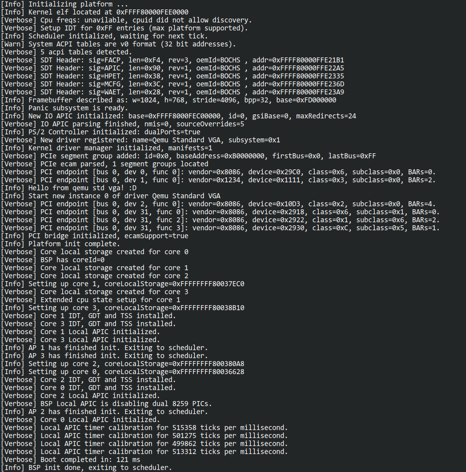

# Northport
Northport is a monolithic kernel and utilities, targeting x86_64.
It's booted via the stivale2 protocol (using limine).

Limited docs about the kernel and other sub-projects are contained under [`docs/`](docs/), all available in markdown format. These are a work in progress, and will be expanded over time (haha).

For instructions on building and running northport, check [here](docs/Building.md).
For the current feature set, check out below!

# Project Goals
## Planned Features
- A relatively competent scheduler, meaning smp aware (and not harmfully so - currently it works around a single global lock), async io and maybe some kind of networking stack.

- While I do want to provide a full libc (and hopefully libc++), I wont be supporting posix or chasing linux compat for now. That would open the door to easily porting a lot of software, but I feel that's been enough times before. It's also not terribly interesting to me. I'd like to follow my own direction for now. We'll see what happens in the future though haha.
I do want to start porting some software at some point (doom, bash).

- A *nice*, if limited, userspace experience. Basic window manager, shell, and other common programs like a file explorer and text editor.

- A port to another hardware platform is something I've been interested in for a while. I'm currently looking at a riscv64i platform, probably just the qemu `virt` platform for now, until I can get some real hardware. 
    - Update: a WIP bootloader for rv64 is in progress. Proper rv64 support will come once we have virtio graphics/block devices supported by the kernel.

- Decent documentation! It'd be nice to get some other people to develop small programs or drivers oneday.

## Current Features
Kernel:
- Physical memory manager (does page frame allocation, in single or multiple pages).
- Per-process virtual memory manager, with paging support for x86 (4 or 5 levels).
- GDT and IDT implementations. IDT implementation is nothing unique, but something I think is quite cool.
- Kernel heap: combination of slab and pool allocators, with some handy debug features.
- Support for simple devices: IO/APIC, Local APIC, PS2 controller/keyboard/mouse, 8254 PIT.
- Scheduler, with support for multiple cores. 
- PCI support, both legacy x86 and ECAM MMIO.
- Loadable drivers. Currently only 2 implemented, for the bochs video adaptor and ram initdisk fs (ustar based).
- Single-root style VFS, full support for mounting/unmount and file lookup. Currently only has the init ramdisk driver implemented.
- IPC, both stream and packet based. 
- System calls. Nothing too technically interesting, but an implementation I'm quite proud of.
- Optional UBsan. Disabled by default as it has a lot of output.
- Logging layer. Can enable/disable the various backends at runtime. Support for debugcon currently, framebuffer and serial planned.

Support libraries:
- np-graphics: cpu-driven graphics, limited drawing functions.
    - A basic linear framebuffer, and terminal (characters-based) renderer implementation. With simple drawing functions.
    - A baked in psf1 & psf2 font, both supported by the terminal renderer.
    - QOI format decoder.
- np-gui: framework for building user interfaces.
    - Provides a wrapper around communication with the window server (also the reference implementation).
- np-syscall: friendly c++ wrapper around kernel system calls.
    - There is also the abi [description](docs/kernel/SystemCalls.md) and [spec](docs/kernel/SystemCallList.md) itself you want to go that route.
- np-syslib: utility library. It provides parts of the STL and std library I miss in a freestanding environment.
    - Printf-compatable string formatting.
    - String <-> number conversions.
    - Can generate stack traces, optionallity prasing elf files (including the kernel!) for symbol names.
    - Some template containers (vector, linked list, circular queue).
    - General utilities, too small and many to list here.
- np-userland: standard library for every userspace program.
    - Currently only provides a heap allocator per process. More coming soon.

Build System:
- All built using stock unix tools, and GNU make. Runs anywhere (tm).

Native Applications:
- startup: currently a test app, but will setup a friendly user environment soon.
- server-window: responsible for managing and rendering windows, communicates to other processes via IPC.

A breakdown of supported (and soon to be supported) features and hardware can be found [here](docs/Roadmap.md).

# Project layout
Each of sub-projects are in their own folder:
- `docs/`: documentation for various parts of the project. 
- `initdisk/`: the init ramdisk for the kernel. All the files included are stored here.
- `iso/`: is where the final iso is built, not included in the git repo.
- `kernel/`: the kernel itself. 
    - `kernel/syscalls/`: each file contains the implementation of a the syscall group of the same name. It's done this way as each group will deal with vastly different functionality.
    - `kernel/arch/`: contains architecture specific code.
    - the other various folders contain code for a specific subsystem.
- `misc/`: contains unrelated project files, limine.cfg lives here.
- `libs/np-xyz/`: contains project files for northport (np) library xyz.
- `libs/build/`: built libraries are stored here, not included in the git repo for obvious reasons.
- `userspace/xyz/`: contains project files for a native app called xyz.

Most sub-projects share a common internal layout:
- `project_name_here/include/`: header files in here, making installing them later really easy.
- `project_name_here/build/`: not included in git repo, but where build files are stored.

# Related Projects
- [DreamOS64](https://github.com/dreamos82/Dreamos64): a 64-bit OS by one of the northport contributors, [Ivan G](https://github.com/dreamos82). 
- [OSdev notes](https://github.com/dreamos82/Osdev-Notes): a repository of notes about various osdev topics. Feel free to contribute!

# Screenshots
Currently not much to see, as there's no gui. Have a boot log for now.

